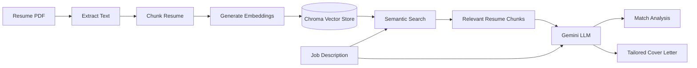

# 🎯 JobFit — AI Job Matching Agent

JobFit is an AI-powered web application that compares a candidate's resume with a target job description and produces an intelligent job-fit report.

It uses **semantic search, embeddings, Chroma vector storage, and Gemini** to retrieve the most relevant resume information before generating the analysis.

## ✨ Features

- 📄 Upload a resume in PDF format
- 💼 Paste a job description
- 🧠 Semantic resume retrieval using embeddings
- 🎯 AI-generated match score (0–100)
- ✅ Matching skills
- ⚠️ Missing skills / skills to improve
- 🤖 AI-generated fit summary
- ✉️ Tailored cover letter generation
- ⬇️ Download generated cover letter
- 🎨 Interactive multi-page Streamlit UI

## 🧠 How JobFit Works

JobFit follows a Retrieval-Augmented Generation (RAG) workflow:



### RAG Pipeline

1. **Ingest** — The uploaded PDF is converted into text.
2. **Chunk** — The resume is split into smaller overlapping sections.
3. **Embed** — Each section is converted into a numerical embedding.
4. **Store** — Embeddings are stored in Chroma.
5. **Retrieve** — The job description is used to find semantically relevant resume sections.
6. **Generate** — Gemini receives the retrieved resume context and job description and generates the final analysis.

## 🛠️ Tech Stack

| Technology | Purpose |
|---|---|
| Python | Core application logic |
| Streamlit | Interactive web UI |
| Gemini | LLM analysis and generation |
| Google Generative AI Embeddings | Semantic embeddings |
| LangChain | RAG pipeline orchestration |
| Chroma | Vector storage and retrieval |
| PyPDFLoader | Resume PDF extraction |
| RecursiveCharacterTextSplitter | Resume chunking |

## 📁 Project Structure

```text
jobfit/
├── app.py                  # Streamlit web application
├── resume_agent.py         # RAG + Gemini backend logic
├── main.py                 # Optional command-line entry point
├── requirements.txt        # Python dependencies
├── .env                    # API key (DO NOT commit)
├── .gitignore              # Git exclusions
└── README.md               # Project documentation
```

## 🚀 Run Locally

### 1. Clone the repository

```bash
git clone <YOUR_GITHUB_REPOSITORY_URL>
cd jobfit
```

### 2. Create a virtual environment

Windows:

```powershell
python -m venv venv
venv\Scripts\activate
```

### 3. Install dependencies

```bash
pip install -r requirements.txt
```

### 4. Add your Gemini API key

Create a `.env` file:

```env
GEMINI_API_KEY=your_api_key_here
```

**Never commit `.env` or expose your API key publicly.**

### 5. Start the application

```bash
streamlit run app.py
```

Then open the local Streamlit URL shown in the terminal.

## 🎨 Application Flow

```text
Dashboard
   ↓
Upload Resume
   ↓
Process PDF + Create Embeddings
   ↓
Paste Job Description
   ↓
Analyze Match
   ↓
Match Results
   ├── Match Score
   ├── Matching Skills
   ├── Missing Skills
   └── AI Summary
   ↓
Generate Tailored Cover Letter
```

## 🔐 Security Notes

- API keys should be stored in environment variables.
- `.env` must remain outside version control.
- Do not upload personal resumes containing sensitive information to a public repository.
- If a secret is accidentally committed, revoke/rotate it immediately.

## 📌 Project Highlights

This project demonstrates practical experience with:

- LLM application development
- Retrieval-Augmented Generation (RAG)
- Vector embeddings
- Semantic search
- Vector databases
- Prompt engineering
- Structured LLM output
- PDF/document processing
- Streamlit application development
- AI-powered content generation

## 🔮 Possible Future Improvements

- Job history / saved analyses
- Multiple resume profiles
- Resume improvement suggestions
- Skill recommendations
- Job recommendation/search integration
- Evaluation metrics for retrieval and match scoring
- Authentication
- Cloud deployment
- Production database/vector-store configuration

## 👩‍💻 Author

**Alishba Waseem**

Built as an AI/GenAI portfolio project.
